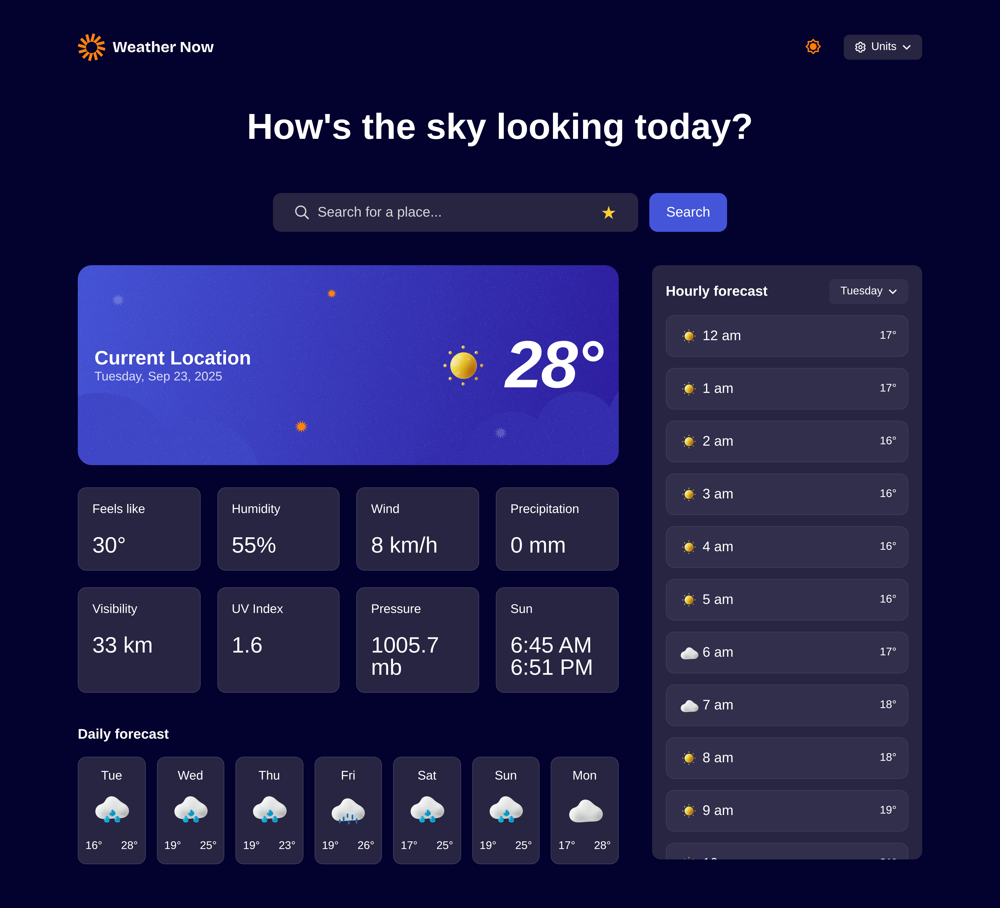

# Frontend Mentor - Weather app solution

This is a solution to the [Weather app challenge on Frontend Mentor](https://www.frontendmentor.io/challenges/weather-app-K1FhddVm49). Frontend Mentor challenges help you improve your coding skills by building realistic projects.

## Table of contents

- [Overview](#overview)
  - [Features](#features)
  - [Planned Features](#planned-features)
  - [Screenshot](#screenshot)
  - [Links](#links)
- [My process](#my-process)
  - [Built with](#built-with)
  - [What I learned](#what-i-learned)
  - [Continued development](#continued-development)
- [Author](#author)

## Overview

### Features

- [x] Search for weather information by entering a location in the search bar
- [x] View current weather conditions including temperature, weather icon, and location details
- [x] See additional weather metrics like "feels like" temperature, humidity percentage, wind speed, and precipitation amounts
- [x] Browse a 7-day weather forecast with daily high/low temperatures and weather icons
- [x] View an hourly forecast showing temperature changes throughout the day
- [x] Switch between different days of the week using the day selector in the hourly forecast section
- [x] Toggle between Imperial and Metric measurement units via the units dropdown
- [x] Switch between specific temperature units (Celsius and Fahrenheit) and measurement units for wind speed (km/h and mph) and precipitation (millimeters) via the units dropdown
- [x] View the optimal layout for the interface depending on their device's screen size
- [x] See hover and focus states for all interactive elements on the page
- [x] Geolocation
- [x] Save one location
- [x] Saved/favorite locations
- [x] UV index, visibility, air pressure data
- [x] Sunrise/sunset times
- [x] Dark/light mode themes
- [x] PWA capabilities

### Planned Features

- [ ] Location comparison
- [ ] Animated weather backgrounds
- [ ] Voice search

### Screenshot

### Links

- Solution URL: [https://github.com/jkaps9/weather-application](https://github.com/jkaps9/weather-application)
- Live Site URL: [https://jkaps9.github.io/weather-application/](https://jkaps9.github.io/weather-application/)

## My process

### Built with

- Semantic HTML5 markup
- CSS custom properties
- Flexbox
- CSS Grid
- Mobile-first workflow
- Vite
- Jest JavaScript testing

### What I learned

- How to turn a website into a Progressive Web App (PWA)
- How to use an API to get updated weather data

### Continued development

Any feedback is welcome!

Learn how to make clean background animations

## Author

- Website - [My Site](https://www.joshfkaplan.com)
- Frontend Mentor - [@jkaps9](https://www.frontendmentor.io/profile/jkaps9)
